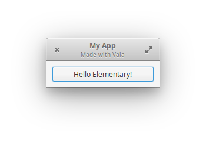
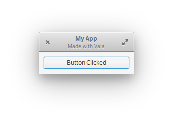

# Playing with Vala and Gtk

I've been putting it off long enough. I'm finally playing around with Vala and Gtk in hopes of developing an application for elementary OS / Linux some day.

The sources of my learning so far have been sparked off by these videos:

- [Create an ElementaryOS app with GTK & Vala! \(ElementaryOS Apps Pt 1\)](https://youtu.be/vxvZGf69nko)
- [Learning about GTK apps with Vala \(ElementaryOS Apps Pt 2\)](https://youtu.be/RWcCsRoH_l4)
- [Vala Tutorial Part 1 - Simple Basic Window App](https://youtu.be/TGyAhkcwXdU)
- [Vala Tutorial Part 2 - Gtk Buttons](https://youtu.be/-nQhk4ViSKg)
- [Vala Tutorial Part 3 - Brief intro to Gtk.Box Layout Container](https://youtu.be/eR8jF-BiqfA)

And these resources:

- https://valadoc.org/
- https://developer.gnome.org/gtk3/stable/
- https://wiki.gnome.org/Projects/Vala/Documentation

### What is does so far

It creates a window with a header and a button. When you click the button, the label changes. Click it again and it changes back. Standard setter/getter stuff.

 
